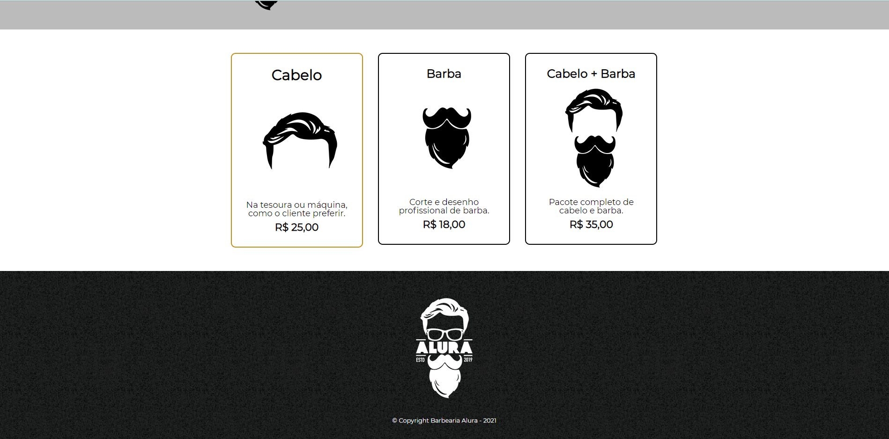
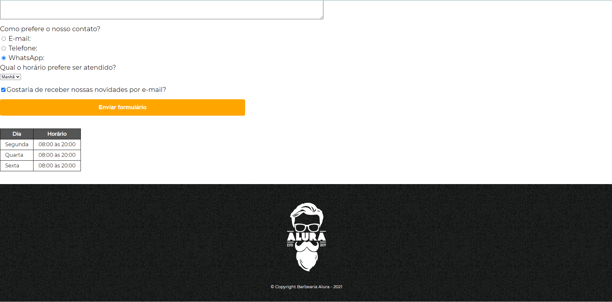

# ALURA'S BARBERSHOP PROJECT

## ABOUT

This repository is for my **studies** on **_HTML5 and CSS3_** through the **Beginner Programming Training** on the **Alura** study platform, in which a website project was developed with the objective of starting my studies for **_front-end web development_**. 

## METHODOLOGY

The development of the project was divided into 4 courses: 

<!--ts-->
   * HTML5 and CSS3 part 1: The first web page
   * HTML5 and CSS3 part 2: Positioning, lists and navigation
   * HTML5 and CSS3 part 3: Working with forms and tables
   * HTML5 and CSS3 part 4: Advanced CSS
<!--te-->

### HTML5 and CSS3 part 1: The first web page

In this course the concept of HTML and CSS were teached, the basic structure of an HTML file and the beginning of the development of the Barbershop's webpage. 

In the basic structure, the teacher taught about structuring with the use of tags, for example: 

<!DOCTYPE html>

<html lang="pt-br">
    
    <meta charset="UTF-8">
    <title>Barbearia Alura</title>

    <h1>SOBRE A BARBEARIA ALURA</h1>

    
Localizada no coração da cidade, a <strong>Barbearia Alura</strong> traz para o mercado o que há de melhor para o seu cabelo e barba. Fundada em 2019, a Barbearia Alura já é destaque na cidade e conquista novos clientes a cada dia.

    
<em>Nossa missão é: <strong>"Proporcionar autoestima e qualidade de vida aos clientes"</strong>.</em>

    
Oferecemos profissionais experientes e antenados às mudanças no mundo da moda. O atendimento possui padrão de excelência e agilidade, garantindo qualidade e satisfação dos nossos clientes.

    
</html>

In addition, the use of CSS3 was presented, along with the teaching of hex colors, image display, lists, classes and content division, as well as the insertion of the header in HTML5. 

With this instruction I was able to develop my first web page.

### HTML5 and CSS3 part 2: Positioning, lists and navigation

In part 2 of the project I learned about navigation between web pages as well as CSS positioning, the difference between inline and block and CSS borders and pseudo-classes.

### HTML5 and CSS3 part 3: Working with forms and tables

In part 3 of the Alura Barbershop project, I developed complex forms that address mobile fields and table information. In addition, I understood and applied CSS hierarchy, and worked with transformations and transitions. 

### HTML5 and CSS3 part 4: Advanced CSS

Finally, in the 4th and last part of the project I worked with advanced CSS, as it was possible to import external content, such as fonts, videos and maps. Furthermore, I worked with pseudo-classes and pseudo-elements, advanced CSS selectors, viewport and responsive design.

## 🛠 TECHNOLOGIES

As seguintes ferramentas foram usadas na construção do projeto:

- [Visual Studio Code](https://code.visualstudio.com/)
- [HTML5](https://html.com/)
- [CSS3](https://www.w3.org/Style/CSS/Overview.en.html)

## RESULT

### index.html:

<h1>
  
  
  
  
</h1>

### produtos.html:

<h1>
  
  
</h1>

### contato.html:

<h1>
  
  
</h1>

### Responsive webpage:

#### Responsive homepage

#### Responsive product page

#### Responsive contact page

